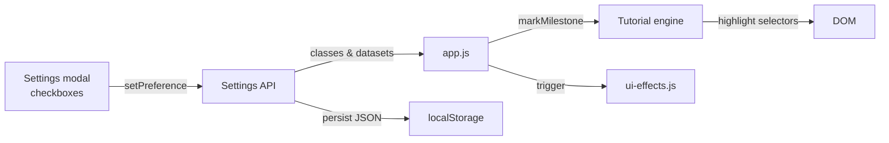

# Papers Empire – Developer Guide

This guide tracks the current architecture after the UX/Accessibility refactor, the toolchain, and the modules you’ll touch most often.

## 1. Runtime Overview
- **Client only:** everything runs in the browser. `index.html` loads plain JS modules in the order listed in the markup.
- **Stateful loop:** `app.js` owns the simulation, rendering, localisation, events, contracts, and saves. A cached `DOM` map avoids repeated query selectors during frames.
- **Settings & tutorial:** `accessibility.js` exposes a `Settings` API that other modules (tutorial, UI effects, app) consume to apply preferences instantly.
- **Effects:** `ui-effects.js` centralises particles + audio beeps; `tutorial.js` manages the guided tour overlay and exposes `markMilestone()` for app integration.

## 2. File Structure (simplified)
```
victorzoo/
├── index.html
├── assets/
│   ├── css/style.css
│   ├── i18n/{fr,en,de,lb}.js
│   └── js/
│       ├── app.js
│       ├── accessibility.js      # Settings store + preference wiring
│       ├── achievements.js
│       ├── events.js             # Narrative event system
│       ├── endgame.js            # Premium contracts & timer state
│       ├── persistence.js
│       ├── modifier-utils.js
│       ├── godmode-utils.js
│       ├── ui-effects.js         # Particles + audio cues
│       └── tutorial.js           # Guided onboarding flow
├── tests/
│   ├── modifiers.test.js
│   ├── godmode.test.js
│   ├── events.test.js
│   ├── i18n.test.js
│   ├── settings.test.js
│   └── playwright/
│       ├── layout.spec.ts
│       ├── contracts.spec.ts
│       ├── events.spec.ts
│       └── tutorial.spec.ts
├── docs/ (Retype sources)
│   ├── accessibility.md
│   ├── DOCUMENTATION.md (this file)
│   ├── RELEASE_NOTES.md
│   └── …
├── playwright.config.ts
├── package.json
└── retype.yml
```

## 3. Key Modules
- **app.js:** entry point. Sets up the DOM cache, localisation, render loop, god mode, contracts, modifiers, log, and event banner. Imports helpers via global variables.
- **accessibility.js:** exposes `Settings` with `getPrefs`, `getPreference`, `setPreference`, and `refresh`. Toggling a setting updates `document.documentElement` immediately and persists to `pe-accessibility`.
- **ui-effects.js:** small particle factory + Web Audio tones. Respects `documentElement.dataset` flags so you can disable sounds or particles without touching the module.
- **tutorial.js:** keeps tutorial steps in memory, controls the overlay, and listens for `markMilestone()` calls. It is intentionally decoupled so we can script custom flows in the future.
- **events.js:** random incidents and minigames with tone metadata push banners and modals through `app.js`.
- **endgame.js:** exposes `EndgameModule` which keeps the premium contract catalog, injects their translations, tracks the active timer, and hands rewards/rerolls back to `app.js`.
- **persistence.js:** thin wrapper around localStorage that serialises the `gameState` slices.

## 4. Settings & Tutorial Flow


## 5. Testing & Commands
- **Unit tests:** `npm run test:unit` sequentially executes all Node tests (modifiers, godmode, events, i18n consistency, settings).
- **E2E tests:** `npm run test:e2e` launches Playwright. Specs cover layout, contracts, events, and the new tutorial/settings UX.
- **Docs:** `npm run docs:build` generates the Retype site into `docs-site/` so CI/GitHub Pages can publish it.

## 6. Documentation & Releases
- Retype sources live in `docs/`. Add a new Markdown file per major feature (events, accessibility, endgame, balance…).
- `docs/RELEASE_NOTES.md` is the canonical changelog. Update it whenever you land a sizeable batch of changes; `AGENTS.md` points to it for release tracking.

## 7. Contracts & Journal Tab
- The card in the right column exposes two tabs. `switchDetailTab()` simply toggles `hidden`/`active` classes and updates the `aria-selected` state so the player can jump between premium contracts and the activity journal without re-rendering the full UI.
- `endgame.js` registers `EndgameModule` which seeds contract translations, surfaces up to three offers through `availableContracts(gameState)`, enforces requirements (quality, image, doc volume) in `startContract()`, and keeps the `activeContract` timer that `renderActiveContract()` reads.
- `handleContractsReroll()` wires the “Refresh offers” button, throttled by `CONTRACT_REROLL_COOLDOWN` (30 s). `updateRerollButton()` swaps the label to `contracts.rerollCountdown` while the button is disabled so the UX explains why nothing happens on click.
- `tickContracts(dt)` now runs inside the `update()` loop, so active deals count down even when the player idles. Once a timer reaches zero, rewards (+DOC/+CC/placeholder “cards”) are applied client-side, a banner/log entry is pushed, and `renderContractsPanel()` picks a replacement offer.
- The Journal tab simply renders `gameState.log` and stays in sync thanks to `renderAll()`; tutorial steps mark the tab once players open it so future onboarding nudges can reference the log.

## 8. Next Steps
- Expand UI effects with reusable animation presets (purchase streaks, tutorial callouts).
- Instrument automated accessibility checks (axe, Playwright) in CI.
- Break `app.js` into dedicated controllers (buildings, upgrades, contracts) to reduce the monolith as features grow.
