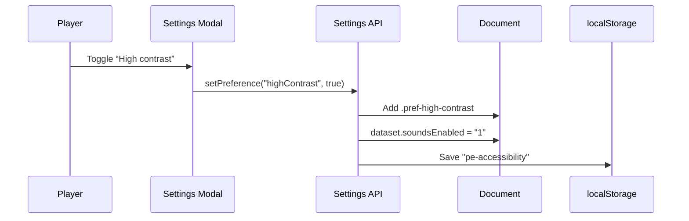

# Accessibility

Papers Empire targets WCAG 2.1 AA and RGAA recommendations. The client now exposes a dedicated settings drawer, richer feedback, and automated tests to keep the experience inclusive.

## Settings Drawer
The ⚙️ button opens a modal built with four sections. All controls are native checkboxes/buttons, receive focus styles, and persist via `pe-accessibility` in `localStorage`.

- **Accessibility tab:** toggles for high contrast, large text (bumps the `:root` font-size), and reduced motion. Each option simply flips a `pref-*` class and is applied before `app.js` renders to avoid flashes.
- **Audio tab:** enables or disables UI bleeps produced by `ui-effects.js`. The toggle maps to `documentElement.dataset.soundsEnabled` so other modules can respect it without reading storage.
- **Interface tab:** controls the particle layer and the guided tutorial. Players can re-run the tutorial at any time through the “Restart tutorial” button.
- **Save tab:** houses export/import/reset buttons so keyboard users can access them without scrolling through the right column.

## Visual & Audio Feedback
`ui-effects.js` centralises particles and minimal Web Audio beeps:

- Clicks trigger a subtle pulse while purchases spawn particles around the pressed button.
- Buying the most expensive building kicks off a confetti celebration + celebration tone.
- All effects bail out automatically when either `pref-reduce-motion` is active or the “Particles” toggle is disabled.

## Guided Tutorial
`assets/js/tutorial.js` orchestrates a first-run overlay that highlights important modules (print button → buildings → journal → settings). It hooks into `Settings` to know whether the user already finished the flow, and exposes `markMilestone()` so `app.js` can advance steps when the player actually completes each action.

## Testing & Tooling
- `tests/settings.test.js` validates that the Settings API toggles classes/datasets correctly and that returned preference objects are copies.
- `tests/playwright/tutorial.spec.ts` drives a full tutorial playthrough plus a regression that ensures high-contrast toggles persist across reloads.
- Layout spec `layout.spec.ts` still guards the iPhone 15 Pro Max centring requirement.

## Preference Flow

## TODO / Ideas
- Axe-core + Playwright automation to catch regressions before shipping.
- Alternate color palettes (deuteranopia/protanopia) exposed as additional toggles.
- Narrated tooltips for the tutorial, possibly with Web Speech API for hands-free accessibility.
- Keyboard shortcut help sheet living near the settings drawer.
