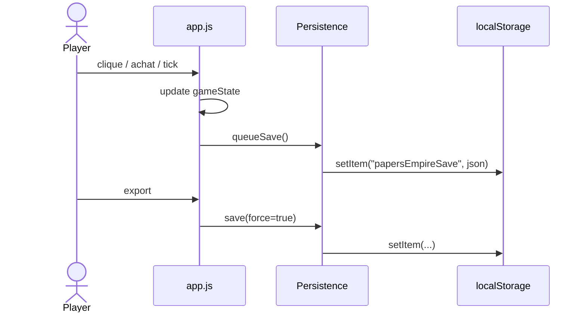
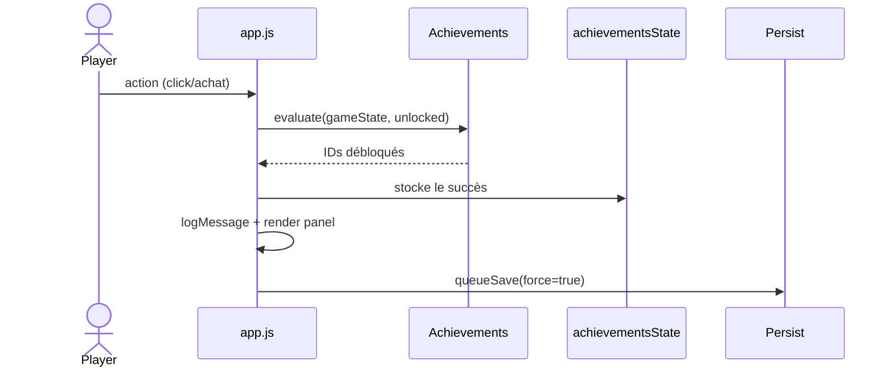

# Architecture

Cette page décrit la structure technique actuelle de Papers Empire. Elle résume les modules clés, les flux de données et présente deux diagrammes de séquence Mermaid.

## Pile Front-end

- **HTML** : `index.html` structure l’application (header sticky, 3 colonnes, panneau progression/sauvegarde).
- **CSS** : `assets/css/style.css` gère layout, responsive, thèmes accessibilité (classes `pref-*`).
- **JavaScript** :
  - `app.js` : boucle de jeu, render, interactions.
  - `persistence.js`, `achievements.js`, `accessibility.js`, `modifier-utils.js` : modules spécialisés.
  - I18n : `assets/i18n/*.js` se chargent via `<script>` et exposent `window.I18N`.

## Flux général

1. `index.html` charge les helpers, i18n, `accessibility.js`, puis `app.js` (defer).
2. `app.js` initialise `gameState`, applique la sauvegarde (si dispo), prépare les handlers et démarre `requestAnimationFrame`.
3. `persistence.js` encapsule `localStorage` (`save/load/clear/export/import`).
4. `accessibility.js` lit les préférences et applique des classes CSS avant le rendu pour éviter les flashs.

## Diagramme : Autosauvegarde

## Diagramme : Succès

## Modules principaux

| Fichier | Rôle |
| --- | --- |
| `assets/js/app.js` | Boucle principale, rendu, UI |
| `assets/js/persistence.js` | Sauvegarde locale, export/import |
| `assets/js/achievements.js` | Définition / évaluation des succès |
| `assets/js/accessibility.js` | Préférences high contrast / texte / motion |
| `tests/*.test.js` | Tests Node (logiciels + i18n) |

## Priorités futures

- Extraire la boucle `requestAnimationFrame` dans un module `loop.js` pour faciliter le throttling et les tests.
- Ajouter des tests Playwright + axe-core pour vérifier l’accessibilité.
- Formaliser un `events.js` pour les futurs mini-jeux + events scénarisés.

Voir aussi :
- [`accessibility.md`](accessibility.md)
- [`game-design.md`](game-design.md)
- [`codex-is-thinking.md`](codex-is-thinking.md)
