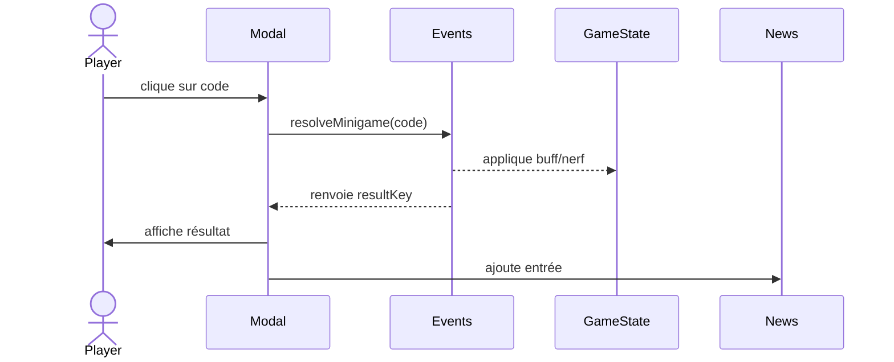

# Events & Mini-games

Pour casser la monotonie, Papers Empire introduit des événements contextuels générés aléatoirement. Chaque événement affiche une narration, exige un choix et peut impacter les ressources/stats ou lancer un mini-jeu.

## Système

- **Génération** : `events.js` tente un spawn toutes les ~30s (modulé par la production). Un cooldown empêche les enchaînements.
- **Types** : `choice` (boutons avec conséquences immédiates) et `minigame` (interaction spéciale).
- **Intégration** : les événements s’affichent dans une modale et alimentent la carte “Actualités”. Les choix sont loggés (`log.event`, `log.eventResult`) et ajoutent des entrées news.
- **Debug** : `window.__PE_DEBUG.spawnEvent("machineBreakdown")` permet de forcer un événement (utilisé par les tests Playwright).

## Catalogue (v1)

| ID | Type | Effet | Notes |
| --- | --- | --- | --- |
| machineBreakdown | choice | Réparer vs ignorer (DOC/qualité) | perte de DOC mais qualité ++ |
| auditQuality | choice | Contrôle complet vs superficiel | confiance +/- |
| newContract | choice | +DOC vs confiance | augmente l’empreinte |
| cyberAttack | choice | Débrancher (perte DOC) vs payer (perte CC) | | 
| sabotage | choice | Enquêter (image +) vs ignorer (image -) | |
| calibrationChallenge | minigame | Bouton matching code -> succès/fail | mini-jeu QTE

## Mini-jeu : calibrage

1. L’événement `calibrationChallenge` génère un code (1,2,3).
2. L’utilisateur doit cliquer sur le bouton correspondant.
3. Succès = +DOC / +qualité, échec = baisse qualité.

## TODO futurs

- Ajouter des événements conditionnés par les stats (ex: si footprint trop haut, visite des autorités).
- Introduire une file d’attente d’événements pour créer des scénarios.
- Mini-jeux supplémentaires (tri des colis, puzzle triage, etc.).
- Support audio/graphique pour rendre les événements plus immersifs.
